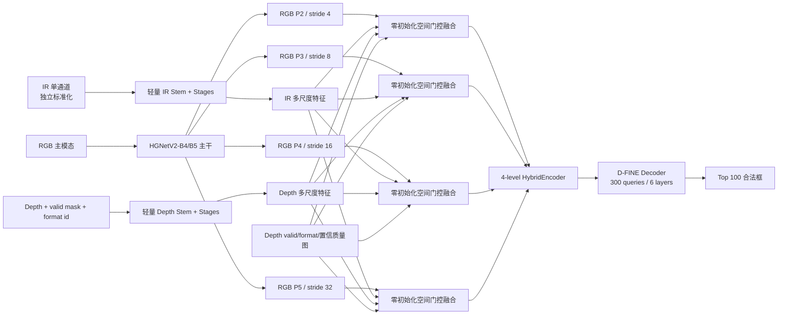

# E10（榜分 54.825）模型缺陷与冲 70 方案

更新日期：2026-08-17

## 1. 结论

- 当前排行榜最优是 **E10：D-FINE-L + RGB + IR**，实际分数 `54.825`。
- 当前严格分组验证集最佳为 `mAP@50–95 = 41.117`、`AP50 = 68.980`、`AP75 = 41.953`。
- E10 比此前 E02 的实际榜分 `44.298` 高 `10.527` 分，说明强检测底座带来的收益成立。
- 目前不能说“D-FINE 加入 Depth 后下降”：`runs/e11_dfine_l_rgbtd` 尚不存在，E11 没有完成同条件实验。
- 旧 YOLO 实验中，E02 RGB-T 最佳验证分 `27.595`，E04 RGB-T-D 为 `27.296`，Depth 只下降 `0.299` 个点。这个差值很小，而且模型、训练长度和融合方式都不足以证明 Depth 天生有害。
- 距离 70 分还差 `15.175` 分。这个差距不可能主要靠学习率或置信度搜索补齐，必须先解决小目标、定位精度、融合位置和训练数据利用率。
- 达到 70 后再用 Optuna 做参数寻优是合理的；更准确的条件是“结构稳定、离线指标与榜分相关性稳定”后再搜索。Optuna 不应承担从 54.825 到 70 的主要增益。

## 2. 已有实验对比

| 实验 | 模态 | 检测器/融合 | 最佳验证 mAP@50–95 | 实际榜分 | 结论 |
|---|---|---|---:|---:|---|
| E01 | RGB | YOLOv5s | 27.127 | - | 单 RGB 基线 |
| E02 | RGB+IR | YOLOv5s + ICAFusion | 27.595 | 44.298 | 旧架构最优 |
| E04 | RGB+IR+Depth | YOLOv5s + ICA + DepthGate | 27.296 | - | 比 E02 低 0.299，不能证明 Depth 无效 |
| E07 | IR | YOLOv5s | 5.783 | - | IR 单独不足以当强教师 |
| E08 | RGB+IR | YOLOv5s + M2D-LIF | 26.057 | - | 弱教师蒸馏没有收益 |
| E10 | RGB+IR | D-FINE-L + 输入残差适配器 | **41.117** | **54.825** | 当前最优 |
| E11 | RGB+IR+Depth | D-FINE-L + 输入残差适配器 | 未运行 | 未提交 | 尚无结论 |

不同检测器的验证分可以用于看趋势，但不能把 E04 与 E10 直接做 Depth 消融。真正有效的 Depth 结论必须来自同一 D-FINE 权重、同一划分、同一分辨率和同一训练日程下的 RGB-T/RGB-T-D 对照。

## 3. 当前 E10 架构

```mermaid
flowchart LR
    subgraph INPUT[同步输入与几何增强]
        RGB[RGB<br/>3×H×W]
        IR[Infrared 灰度复制为 3 通道<br/>3×H×W]
    end

    subgraph ADAPTER[FrequencyResidualInputAdapter]
        LOW[IR 2×平均池化后上采样<br/>低频结构]
        HIGH[abs IR - Low<br/>高频幅值]
        CAT[拼接<br/>6×H×W]
        PROJ[3×3 Conv 6→32<br/>BN + SiLU<br/>1×1 Conv 32→3<br/>末层零初始化]
        GATE[单个可学习标量 gate]
        ADD[RGB + gate × IR residual<br/>融合结果仍为 3 通道]
    end

    subgraph BACKBONE[HGNetV2-B4 RGB 预训练主干]
        STEM[冻结 Stem / Frozen BN]
        C3[C3 stride 8<br/>512 channels]
        C4[C4 stride 16<br/>1024 channels]
        C5[C5 stride 32<br/>2048 channels]
    end

    subgraph NECK[HybridEncoder]
        AIFI[AIFI Transformer<br/>最高层 1 层 / 8 heads]
        FPN[FPN + PAN 跨尺度融合]
        P3[P3 stride 8<br/>256 channels]
        P4[P4 stride 16<br/>256 channels]
        P5[P5 stride 32<br/>256 channels]
    end

    subgraph HEAD[D-FINE Transformer]
        QUERY[300 object queries]
        DEC[6 层 Deformable Decoder<br/>细粒度分布框回归 reg_max=32]
        LOSS[Hungarian Matching<br/>VFL + L1 + GIoU + FGL + DDF]
        TOP[推理取全类别 Top 100]
        ZIP[归一化 xywh + score<br/>1000 个 TXT → ZIP]
    end

    IR --> LOW
    IR --> HIGH
    LOW --> CAT
    HIGH --> CAT
    CAT --> PROJ
    PROJ --> GATE
    RGB --> ADD
    GATE --> ADD
    ADD --> STEM --> C3 --> C4 --> C5
    C3 --> FPN
    C4 --> FPN
    C5 --> AIFI --> FPN
    FPN --> P3
    FPN --> P4
    FPN --> P5
    P3 --> QUERY
    P4 --> QUERY
    P5 --> QUERY
    QUERY --> DEC --> TOP --> ZIP
    LOSS -.训练监督.-> DEC
```



这里的“RGB-T 双模态”并不是两个完整主干。IR 在进入主干前被压缩为 3 通道残差并加到 RGB，后续 HGNetV2、HybridEncoder 和 D-FINE Decoder 都只看到一个已经混合的张量。

## 4. 当前模型的主要缺陷

### 4.1 小目标能力是第一瓶颈

E10 最佳验证指标：

| 尺度 | AP |
|---|---:|
| Small | **16.623** |
| Medium | 33.609 |
| Large | 59.415 |

当前特征只使用 stride 8/16/32，没有 stride 4 的 P2。所有图像还会缩放到 `960×960`；对原始 `1920×1080` 图像而言，小目标信息在进入 P3 前已经明显损失。

逐类结果同样指向小目标问题：`ball AP=13.07`、`sign AP=29.35`、`garbage_can AP=33.80`。其中 ball 的 `AP50=50.22`，但综合 AP 只有 `13.07`，说明既有漏检，也有严重的框定位误差。

### 4.2 高 IoU 定位精度不足

- AP50：`68.980`
- AP75：`41.953`
- 差值：`27.027`

模型在 IoU=0.5 时已经能找到大量目标，但框不够紧。排行榜使用 0.50～0.95 的平均 AP，单纯提高召回率不能解决问题。需要保留更高分辨率特征、减少长宽比扭曲，并给 Decoder 更准确的浅层边缘特征。

### 4.3 融合发生得太早，而且信息压缩过强

IR 的低频和高频共 6 通道被两层卷积直接压成 3 通道，然后加到 RGB。缺陷包括：

1. IR 没有独立的多尺度语义特征，进入冻结 RGB Stem 前就被迫伪装成 RGB 残差。
2. 全图只有一个标量 gate，不能区分白天/夜晚、目标区域/背景区域或 IR 失效区域。
3. 融合只发生一次，P3/P4/P5 无法按尺度选择 IR 信息。
4. 冻结 Stem 和 Frozen BN 会限制融合后输入分布的适配。
5. 当前适配器主要提取频率残差，却没有显式的跨模态空间对齐或通道注意力。

### 4.4 训练日程没有充分发挥第二阶段

E10 共 120 epoch，但最佳点出现在 epoch 60。RandomZoomOut/RandomIoUCrop 和多尺度策略直到 epoch 105 才停止，学习率到 epoch 110 才下降，只留下很短的干净精调区间。

这表明当前日程后半段主要在平台期震荡：强几何增强停止得过晚，精定位阶段太短。对于 mAP@50–95，更合理的是较早停止强裁剪，再留 30～40 epoch 做固定高分辨率精调。

### 4.5 有效 batch 太小

当前总 batch size 为 4，而 D-FINE 默认配置按总 batch 32 设计。虽然学习率已经缩放、BN 已冻结，但梯度噪声仍然很大。使用梯度累积把有效 batch 提到 16 或 32，会比继续降低学习率更合理。

### 4.6 类别长尾严重，宏平均指标会放大弱类影响

训练集类别数量从 person 的 3737 个框到 tricycle 的 18 个框，相差约 208 倍：

| 弱类 | 训练框数 | E10 最新逐类 AP |
|---|---:|---:|
| ball | 65 | **13.07** |
| sign | 545 | 29.35 |
| garbage_can | 190 | 33.80 |
| tricycle | 18 | 39.27（验证仅 7 框，方差很大） |
| boat | 98 | 43.90 |

当前最多 3 倍的按图重复采样会同时重复图中的 person 等常见类，不能真正解决稀有实例不足。需要实例级 Copy-Paste、弱类采样和类别感知的 Top-100 竞争校准。

### 4.7 验证集与排行榜仍有明显分布差异

严格分组验证为 41.117，而榜分为 54.825，差 `13.708`。当前分组验证适合评估跨场景泛化，但不能单独预测榜分。应该同时保留：

- Strict Group Holdout：防止只记忆背景；
- Leaderboard Proxy：按帧分层、近似测试集场景组成，用于主模型选择。

所有结构选择要同时报告两套指标，最终确定方案后才使用全部 2000 张训练图。

## 5. Depth 为什么可能拖后腿

### 5.1 目前只能说“朴素 Depth 融合没有收益”

旧实验 E04 比 E02 低 0.299 个验证点，属于弱负收益；E11 尚未运行，因此当前最优仍是双模态，但不能得出“Depth 无效”的结论。

### 5.2 数据格式本身存在域差异

| 划分 | 16-bit PNG Depth | 8-bit JPG Depth |
|---|---:|---:|
| train | 1540 / 1598（96.4%） | 58 / 1598（3.6%） |
| val | 311 / 402（77.4%） | 91 / 402（22.6%） |
| test | 845 / 1000（84.5%） | 155 / 1000（15.5%） |

16-bit PNG 被当作度量深度并做 log 归一化；8-bit JPG 只能当相对灰度。训练集里的 8-bit Depth 太少，而验证和测试占比明显更高，Depth 分支很容易学到格式而不是几何。

### 5.3 当前三模态适配器不具备质量控制

RGB-T-D 配置只是增加第二个输入残差适配器：

`RGB + gate_ir × residual_ir + gate_depth × residual_depth`

Depth 的孔洞、截断、格式差异和局部噪声只由一个全局标量控制。即使某个区域 Depth 无效，仍会把残差加进 RGB。合理做法是使用有效掩码、格式嵌入和空间质量门控，让 Depth 在不可靠区域自动退化为 0。

## 6. 推荐目标架构

RGB 保持主模态和完整预训练路径；IR、Depth 作为可退化为零的辅助分支，在多个尺度注入，而不是在输入端一次性混合。



建议融合公式：

```text
F_l = F_rgb_l
    + sigmoid(g_ir_l) * A_ir_l(F_ir_l)
    + q_depth_l * sigmoid(g_depth_l) * A_depth_l(F_depth_l)
```

其中辅助投影和 gate 都采用零初始化，使模型初始时严格等价于 RGB 主模型；Depth 无效时 `q_depth_l≈0`，不会破坏 RGB-T 已有能力。

## 7. 冲 70 的完整实验方案

不靠大量 smoke test，建议只保留三次完整主实验和一次最终全量训练。

### E12：改进版 D-FINE-L RGB-T（第一主实验）

一次性完成以下改动：

1. 从输入端单次融合改为 P2/P3/P4/P5 多尺度零初始化门控融合；RGB 是主干，IR 使用轻量共享权重或浅层独立分支。
2. 加入 stride-4 P2，HybridEncoder 改成 4-level，重点修复 ball/sign/garbage_can。
3. 输入改为保持 16:9 的高分辨率训练，优先 `1280×720` 或显存允许时 `1536×864`，不再强制拉伸成正方形。
4. 有效 batch 通过梯度累积提高到 16；冻结 BN，但解冻 RGB Stem 的后半部分供融合适配。
5. 训练 110～130 epoch；约 60% 进度停止 RandomIoUCrop/ZoomOut，最后 35～40 epoch 固定高分辨率精调框定位。
6. 加入弱类实例级 Copy-Paste；ball、boat、garbage_can、tricycle 采用受控采样，避免只重复整张图。
7. 保留 EMA、D-FINE 原始 Hungarian/VFL/FGL 损失，不同时更换检测头。

E12 是当前最重要的实验。验收不仅看总 AP，还要求：Small AP 明显高于 16.62、AP75 明显高于 41.95、ball AP 不再处于 13 左右。

### E13：D-FINE-X RGB-T（第二主实验）

把 E12 已验证的多尺度融合移到 D-FINE-X/更强 HGNetV2 主干，加载允许使用的 Objects365+COCO 预训练权重。保持数据、分辨率和融合结构不变，避免把“更大模型”和“新融合”混在一次不可解释的变化里。

如果显存不足，使用梯度累积和 activation checkpointing，不回退到 960 正方形输入。E13 目标是提高定位上限和稀有类特征质量，而不是单纯增加 epoch。

### E14：质量门控 RGB-T-D（第三主实验，可淘汰）

从 E12/E13 最优 RGB-T 权重开始：

1. Depth 分支零初始化，初始输出必须与 RGB-T 数值等价。
2. 16-bit PNG 与 8-bit JPG 使用不同归一化统计和 format embedding。
3. 输入为 `log-depth/inverse-depth + valid mask + format flag`。
4. 使用像素级和尺度级质量门控，而不是单个全局 gate。
5. 训练中做 Depth modality dropout，使模型在 Depth 低质量时回退到 RGB-T。
6. 按 Depth 格式平衡采样，补偿 train 中 8-bit 样本只有 3.6% 的问题。

Depth 的保留门槛：在相同验证协议下，总 mAP 至少提高 `0.8` 个百分点，且 Small AP、AP75 和弱类 AP 不下降。达不到就淘汰 Depth，最终提交继续使用 RGB-T。Depth 是候选增益，不是必须加入的模态。

### E15：全部 2000 张官方训练图最终训练

结构确定后，把 train+val 共 2000 张全部用于训练：

- 从最佳 E12/E13/E14 权重继续训练；
- 使用此前确定的固定日程，不再根据测试榜反复修改；
- 只生成一个单模型、单 checkpoint 的最终 ZIP；
- 不使用测试集伪标签，不做规则未确认的多模型 WBF。

当前已有 E10f 配置只做 30 epoch 全量微调，可以作为低风险增益，但它不会替代上面的结构改进。

## 8. 推理侧可直接优化的部分

这些改动应基于缓存的验证预测一次性离线扫描，不需要重复训练：

1. `num_top_queries`：比较 50、75、100。当前 12 类共同竞争 Top-100，常见类可能挤掉低分弱类。
2. 类别感知分数校准：只在 Top-100 截断前有意义；COCO AP 在每类内部按分数排序，简单全局温度缩放不会提高 AP。
3. D-FINE 默认无 NMS，可验证轻量 class-aware NMS 是否能删除重复框并释放 Top-100 名额。
4. 置信度阈值主要影响文件大小和极低分框；只要不截掉真阳性，它不会凭空带来十几分。
5. 若赛事明确允许单模型多尺度/切片推理，可对 1920×1080 图像加入 full-image + tile 推理；规则未确认前不作为默认提交方案。

## 9. Optuna 是否合理

合理，但使用顺序必须正确。

### 开始 Optuna 的条件

- 主架构固定为 E12/E13/E14 中的一种；
- 提交链路和本地评测已锁定；
- Strict 与 Proxy 两套验证对模型优劣的排序基本一致；
- 最好实际榜分已到 70，或者至少已经非常接近且结构增益饱和。

### 建议搜索参数

- 主干、融合适配器、Encoder/Decoder 的分组学习率；
- weight decay、warmup、强增强停止 epoch；
- IR/Depth modality dropout；
- Copy-Paste 概率和弱类采样强度；
- D-FINE `loss_bbox/loss_giou/loss_fgl` 权重；
- 输入尺度、有效 batch、梯度裁剪；
- Top-K、类别校准和可选 NMS 阈值。

### 不建议的做法

- 用公共排行榜分数直接做 Optuna objective，会迅速过拟合 public test；
- 对当前 E10 做几十次完整 120-epoch 搜索，成本高且补不了结构性 15 分差距；
- 同时搜索架构、数据增强、Depth 表示和后处理，结果无法解释；
- 把全局 confidence 当作主要超参数，COCO AP 对单调分数变换基本不敏感。

建议采用带 pruning 的多保真搜索：先用 30～50 epoch 评估趋势，保留前 3 个 trial 做完整训练；最终目标使用 `0.7 × Proxy mAP + 0.3 × Strict mAP`，并给 Strict 设置最低约束。达到 70 后，Optuna 更可能贡献最后 1～3 分，而不是 15 分。

## 10. 最终决策

1. **当前最优仍是双模态 RGB-T。** 这是现有排行榜和验证实验共同支持的结论。
2. **不能说 Depth 已被证明有害。** 当前只证明旧的朴素融合没有收益；D-FINE 三模态同条件实验还没跑。
3. **主攻方向不是继续微调当前输入适配器。** 应升级为 16:9 高分辨率、P2 小目标层和多尺度 RGB 主导门控融合。
4. **Depth 必须带质量门控，并允许自动退化为零。** 否则宁可不用。
5. **Optuna 放在结构稳定或榜分达到 70 后是合理的。** 先获取结构性增益，再做参数寻优。
